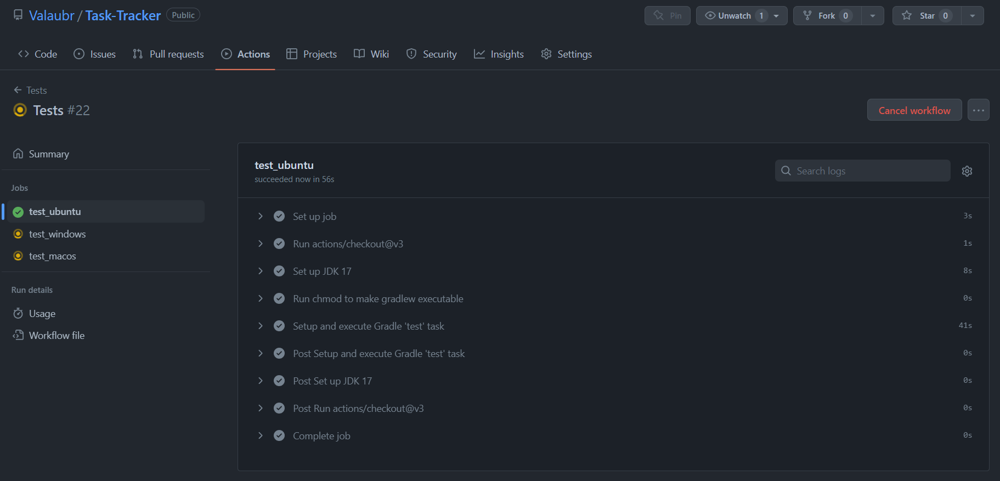

**Task-tracker**

Simple task tracker for your team

**Project maintainer:**

Чупрынин Илья, гр.3530901/90101

**Installations**

git clone https://github.com/Valaubr/Task-Tracker.git

open in IDE and build or use /gradle build -> cd build/libs/ -> java -jar Task-Tracker-0.0.1-SNAPSHOT.jar

**Using with Docker**

cd <pathToDownladRepository>/Task-Tracker
docker build --tag tracker .
run -p 8080:8080 tracker

For test recomended use Insomnia or PostMan:

Task 3 report:
Github actions настроен на пулл реквест в main и по ручому триггеру:
Пулл реквест:

Ручной триггер:

